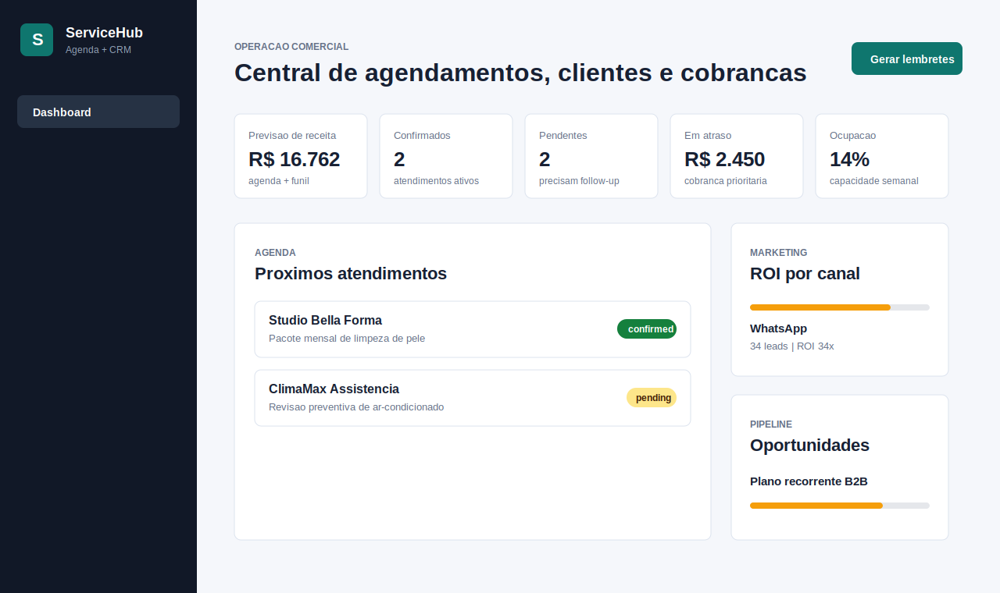

# ServiceHub Agendamentos CRM

CRM operacional para negocios de servicos que precisam controlar agenda, clientes, funil comercial, cobrancas e lembretes de atendimento em um unico painel.



## Valor comercial

Este projeto simula uma solucao vendavel para clinicas, assistencias tecnicas, studios de estetica, oficinas e prestadores locais que perdem receita por falta de follow-up, agenda baguncada e cobrancas atrasadas. A proposta e mostrar capacidade pratica em criar um sistema web com API, dashboard, dados de exemplo e automacoes simuladas sem depender de servicos externos para rodar a demo.

## Funcionalidades

- Dashboard com previsao de receita, ocupacao semanal, agendamentos confirmados, pendencias e cobrancas em atraso.
- Agenda enriquecida com cliente, servico, canal de origem, profissional, preco e status.
- Cadastro de novo agendamento via API e pelo botao de demo da interface.
- Funil comercial ponderado por probabilidade.
- ROI por canal de marketing com dados de leads, agenda e receita.
- Simulacao de fila de lembretes por WhatsApp/e-mail sem envio real de mensagens.
- API documentada com endpoints REST em Node.js nativo.
- Seed comercial pronto em `data/seed.json`.
- Testes automatizados e smoke test de API + frontend estatico.

## Stack

- Node.js 24
- HTTP server nativo, sem dependencias externas
- HTML, CSS e JavaScript puro no frontend
- `node:test` para validacao automatizada
- Dockerfile para deploy em container

## Como rodar localmente

```bash
npm start
```

Acesse:

```text
http://localhost:3000
```

Se estiver em um ambiente sem `npm`, rode diretamente:

```bash
node src/server.js
```

## Validacao

```bash
npm test
npm run smoke
```

Sem `npm`:

```bash
node --test tests/*.test.js
node tests/smoke.js
```

## Endpoints

| Metodo | Rota | Descricao |
| --- | --- | --- |
| `GET` | `/api/health` | Status da aplicacao |
| `GET` | `/api/metrics` | Indicadores comerciais consolidados |
| `GET` | `/api/customers` | Lista de clientes |
| `GET` | `/api/appointments` | Lista de agendamentos enriquecida |
| `POST` | `/api/appointments` | Cria agendamento |
| `PATCH` | `/api/appointments/:id/status` | Atualiza status de agendamento |
| `GET` | `/api/pipeline` | Oportunidades do funil |
| `GET` | `/api/invoices` | Cobrancas abertas e atrasadas |
| `POST` | `/api/automations/reminders` | Gera fila simulada de lembretes |

Exemplo de criacao de agendamento:

```bash
curl -X POST http://localhost:3000/api/appointments \
  -H "content-type: application/json" \
  -d '{
    "customerId": "cus_1001",
    "service": "Avaliacao recorrente",
    "scheduledAt": "2026-07-11T10:00:00-03:00",
    "durationMinutes": 50,
    "professional": "Juliana",
    "price": 340,
    "channel": "Portal"
  }'
```

## Deploy

### Docker

```bash
docker build -t servicehub-agendamentos-crm .
docker run --rm -p 3000:3000 servicehub-agendamentos-crm
```

### Render, Railway ou Fly.io

- Build command: nenhum, o projeto nao precisa compilar.
- Start command: `node src/server.js`
- Variavel obrigatoria: `PORT`, normalmente definida pela propria plataforma.

## Diferenciais para portifolio

- Problema comercial claro: faltas em agenda, baixa conversao, cobrancas atrasadas e falta de visao operacional.
- Demonstra backend, frontend, modelagem de dados, validacao de payload e automacao simulada.
- Pode evoluir para multiempresa, autenticacao, banco real, integracao WhatsApp Business Cloud, pagamentos e calendario externo.

## Melhorias possiveis

- Persistencia com PostgreSQL ou SQLite.
- Autenticacao com perfis de administrador, comercial e atendimento.
- Integracao real com WhatsApp Business Cloud para envio de lembretes.
- Webhooks de pagamento para baixa automatica de cobrancas.
- Exportacao de relatorios em CSV/PDF.
- Deploy real com banco gerenciado e pipeline CI.
